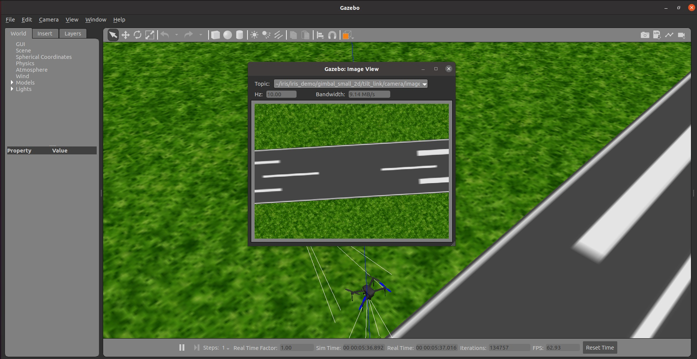
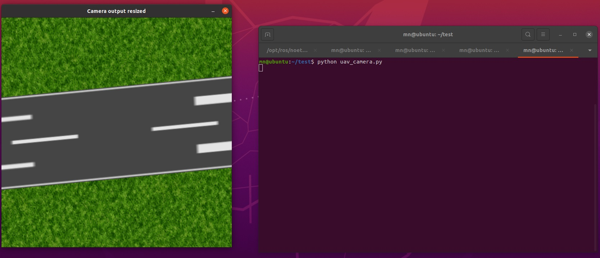

# Multi-UAV Gazebo Simulation
Tutorial for Multi-UAV (Quadcopters) simulation in Gazebo and Ardupilot.

## Prerequisites
- Ubuntu
- ROS
- Gazebo
- Ardupilot
- Ardupilot_gazebo plugin
- Docker
- Mavproxy

## Installation
### Ubuntu
Ubuntu 20.04 inside a Virtual Machine (VM) used in this tutorial.

### ROS
The ROS noetic is used in this tutorial. You can use steps below to install it:
```
sudo sh -c 'echo "deb http://packages.ros.org/ros/ubuntu $(lsb_release -sc) main" > /etc/apt/sources.list.d/ros-latest.list'
sudo apt install curl
curl -s https://raw.githubusercontent.com/ros/rosdistro/master/ros.asc | sudo apt-key add -
sudo apt update
sudo apt install ros-noetic-desktop-full
echo "source /opt/ros/noetic/setup.bash" >> ~/.bashrc
source ~/.bashrc
sudo apt install python3-rosdep python3-rosinstall python3-rosinstall-generator python3-wstool build-essential
sudo apt install python3-rosdep
sudo rosdep init
rosdep update
```

### Gazebo
The Gazebo version 11 is used in this tutorial. ROS noetic has gazebo11 but if there is problem with it, you can use steps below to install it:
```
sudo sh -c 'echo "deb http://packages.osrfoundation.org/gazebo/ubuntu-stable `lsb_release -cs` main" > /etc/apt/sources.list.d/gazebo-stable.list'
wget http://packages.osrfoundation.org/gazebo.key -O - | sudo apt-key add –
sudo apt-get update
sudo apt-get install gazebo11 libgazebo11-dev
```
If you are using Ubuntu in a VM and gazebo has graphical problems, put the line below inside your bash (bashrc, zshrc, ...):
```
export SVGA_VGPU10=0
```

### Ardupilot
The latest version (4.3.6 at the time of writing) used in this tutorial. You can use steps below to install it:
```
git clone https://github.com/ArduPilot/ardupilot.git
cd ardupilot
git submodule update --init –recursive
alias waf="$PWD/modules/waf/waf-light"
waf configure --board=sitl
waf all
./Tools/environment_install/install-prereqs-ubuntu.sh -y
```

### Ardupilot_gazebo
```
git clone https://github.com/SwiftGust/ardupilot_gazebo
cd ardupilot_gazebo
mkdir build
cd build
cmake ..
make -j2
sudo make install
```
After installation of this plugin, you need to add lines below inside your bash (bashrc, zshrc, ...):
```
source /usr/share/gazebo/setup.sh
export GAZEBO_MODEL_PATH=~/ardupilot_gazebo/models:${GAZEBO_MODEL_PATH}
export GAZEBO_MODEL_PATH=~/ardupilot_gazebo/models_gazebo:${GAZEBO_MODEL_PATH}
export GAZEBO_RESOURCE_PATH=~/ardupilot_gazebo/worlds:${GAZEBO_RESOURCE_PATH}
export GAZEBO_PLUGIN_PATH=~/ardupilot_gazebo/build:${GAZEBO_PLUGIN_PATH}
```

### Docker
The latest version (23.0.6 at the time of writing) used in this tutorial. You can use steps below to install it:
```
sudo apt-get update
sudo apt-get install ca-certificates curl gnupg
sudo install -m 0755 -d /etc/apt/keyrings
curl -fsSL https://download.docker.com/linux/ubuntu/gpg | sudo gpg --dearmor -o /etc/apt/keyrings/docker.gpg
sudo chmod a+r /etc/apt/keyrings/docker.gpg
echo \
  "deb [arch="$(dpkg --print-architecture)" signed-by=/etc/apt/keyrings/docker.gpg] https://download.docker.com/linux/ubuntu \
  "$(. /etc/os-release && echo "$VERSION_CODENAME")" stable" | \
sudo tee /etc/apt/sources.list.d/docker.list > /dev/null
sudo apt-get update
sudo apt-get install docker-ce docker-ce-cli containerd.io docker-buildx-plugin docker-compose-plugin
```

## Run single UAV
- Open a terminal and run the commands below:
```
cd ~/ardupilot/Tools/autotest
./sim_vehicle.py -v ArduCopter -f gazebo-iris --console -I0
```
- Open a new terminal and run:
```
gazebo --verbose ~/ardupilot_gazebo/worlds/iris_ardupilot.world
```
- After seeing "APM: EKF2 IMU0 is using GPS" message in console, you can use the commands below in the first terminal for takeoff test:
```
mode guided
arm throttle
takeoff 5
```

## Run multiple UAVs
- For any number of UAVs that you want to simulate, make a copy of "iris_with_standoffs_demo" from ardupliot_gazebo/models folder (iris_with_standoffs_demo_1, iris_with_standoffs_demo_2, iris_with_standoffs_demo_3, ...).
- Open "model.sdf" file inside of each iris_with_standoffs_demo folder and change <fdm_port_in> and <fdm_port_out> under plugin name="arducopter_plugin" tag. For example for the first UAV (iris_with_standoffs_demo_1) use below:
```
    <plugin name="arducopter_plugin" filename="libArduPilotPlugin.so">
      <fdm_addr>127.0.0.1</fdm_addr>
      <fdm_port_in>9002</fdm_port_in>
      <fdm_port_out>9003</fdm_port_out>
```
- For second UAV (iris_with_standoffs_demo_2) use below:
```
    <plugin name="arducopter_plugin" filename="libArduPilotPlugin.so">
      <fdm_addr>127.0.0.1</fdm_addr>
      <fdm_port_in>9012</fdm_port_in>
      <fdm_port_out>9013</fdm_port_out>
```
- And so on for each UAV add "10" to each port (9002-9003, 9012-9013, 9022-9023, 9032-9033, ...).

- Now make a copy of iris_ardupilot.world from ardupilot_gazebo/worlds folder:
```
cd ~/ardupilot_gazebo/worlds
cp iris_ardupilot.world iris_multiuav.world
```
- Open the new iris_multiuav.world file and change the bottom of file from this:
```
    <model name="iris">
      <pose> 0 0 0 0 0 0 </pose>
      <include>
        <uri>model://iris_with_standoffs_demo</uri>
         <pose> 0 0 0 0 0 0 </pose>
      </include>
    </model>
```
- To this (this is for 4 UAV example):
```
    <model name="iris_demo_1">
      <pose> 0 0 0 0 0 0 0 </pose>
      <include>
        <uri>model://iris_with_standoffs_demo_1</uri>
      </include>
    </model>
    <model name="iris_demo_2">
      <pose> -10 -10 0 0 0 0 0 </pose>
      <include>
        <uri>model://iris_with_standoffs_demo_2</uri>
      </include>
    </model>
    <model name="iris_demo_3">
      <pose> -20 0 0 0 0 0 0 </pose>   
      <include>
        <uri>model://iris_with_standoffs_demo_3</uri>
      </include>
    </model>
    <model name="iris_demo_4">
      <pose> -10 10 0 0 0 0 0 </pose>     
      <include>
        <uri>model://iris_with_standoffs_demo_4</uri>
      </include>
    </model>
```
- Open a terminal for each UAV and run the commands below in each of them (4 UAV example):
```
# First terminal:
cd ~/ardupilot1/Tools/autotest
./sim_vehicle.py -v ArduCopter -f gazebo-iris --console -I0

# Second terminal:
cd ~/ardupilot1/Tools/autotest
./sim_vehicle.py -v ArduCopter -f gazebo-iris --console -I1

# Third terminal:
cd ~/ardupilot1/Tools/autotest
./sim_vehicle.py -v ArduCopter -f gazebo-iris --console -I2

# Fourth terminal:
cd ~/ardupilot1/Tools/autotest
./sim_vehicle.py -v ArduCopter -f gazebo-iris --console -I3
```
- Open a new terminal and run the command below:
```
gazebo --verbose ~/ardupilot_gazebo/worlds/iris_multiuav.world
```
- Wait for each UAV to get "APM: EKF2 IMU0 is using GPS" message and then you can control UAVs.

## Run multiple UAVs using Docker
- Note that you still need to install mavproxy and ardupilot_gazebo plugin and make a copy of iris_with_standoffs_demo for each UAV (if you did previous step you do not have to do it again).
- You can use docker provided [here](<https://hub.docker.com/r/radarku/sitl-swarm>):
```
docker pull radarku/sitl-swarm
```
- Run the docker by command below (use NUMCOPTERS for the number of UAVs you want):
```
docker run --rm -p 5760-5810:5760-5810 --env NUMCOPTERS=4 radarku/sitl-swarm
```
- You need to change startArdu.sh inside "radarku/sitl-swarm" docker, you can use the startArdu.sh file in repo and replace it inside docker with commands below:
```
# After running radarku/sitl-swarm docker and made a copy of startArdu.sh in your home directory:
docker cp ~/startArdu.sh [container_name]:/startArdu.sh
docker commit [container_name] sitl-swarm
```
- Now run the new docker with command below:
```
docker run --rm --network="host" -p 5760-5810:5760-5810 --env NUMCOPTERS=4 sitl-swarm
```
- Open a terminal for each UAV and run the commands below in each of them (4 UAV example):
```
# First terminal:
mavproxy.py --master=tcp:localhost:5760

# Second terminal:
mavproxy.py --master=tcp:localhost:5770

# Third terminal:
mavproxy.py --master=tcp:localhost:5780

# Fourth terminal:
mavproxy.py --master=tcp:localhost:5790
```
- Open a new terminal and run the command below:
```
gazebo --verbose ~/ardupilot_gazebo/worlds/iris_multiuav.world
```
- Wait for each UAV to get "APM: EKF2 IMU0 is using GPS" message and then you can control UAVs.

## Publish UAV's camera feed on ROS topic
- Install dependencies.
```
sudo apt-get install ros-noetic-gazebo-ros-pkgs ros-noetic-gazebo-ros-control
```
- Go inside ardupilot_gazebo/models_gazebo folder and make a copy of gimbal_small_2d folder and rename it to gimbal_1 (you can do this for each uav, e.g. gimbal_2, gimbal_3,...).
- Go to gimbal_1 and open model.sdf file and under <sensor> tag put the lines below (for gimbal_2 change cameraName to uav2 and so on):
```
         <plugin name="camera_controller" filename="libgazebo_ros_camera.so">
           <cameraName>uav1/camera1</cameraName>
           <imageTopicName>image_raw</imageTopicName>
           <cameraInfoTopicName>camera_info</cameraInfoTopicName>
           <frameName>camera_link_optical</frameName>
           <hackBaseline>0.0</hackBaseline>
           <distortionK1>0.0</distortionK1>
           <distortionK2>0.0</distortionK2>
           <distortionK3>0.0</distortionK3>
           <distortionT1>0.0</distortionT1>
           <distortionT2>0.0</distortionT2>
           <CxPrime>0</CxPrime>
           <Cx>0.0</Cx>
           <Cy>0.0</Cy>
           <focalLength>0.0</focalLength>
         </plugin>
```
- Go to ardupilot_gazebo/models/iris_with_standoffs_demo_1 folder and inside model.sdf file change this:
```
    <include>
      <uri>model://gimbal_small_2d</uri>
      <pose>0 -0.01 0.070 1.57 0 1.57</pose>
    </include>
```
- To this (do this for each UAV):
```
    <include>
      <uri>model://gimbal_1</uri>
      <pose>0 -0.01 0.070 1.57 0 1.57</pose>
    </include>
```
- Go to /opt/ros/noetic/share/gazebo_ros/launch/ folder and copy multi.launch file from repo to there (change "world_name" argument in this file according to your world file).
- Open a terminal and use the command below to launch your world (this will launch gazebo):
```
roslaunch gazebo_ros multi.launch
```
- Open a new terminal and run a UAV:
```
cd ~/ardupilot/Tools/autotest && ./sim_vehicle.py -v ArduCopter -f gazebo-iris -I0
```
- After seeing "APM: EKF2 IMU0 is using GPS" message in console, you can use the commands below to takeoff:
```
mode guided
arm throttle
takeoff 50
```
- You can use Topic Visualization from Window menu inside Gazebo (or press Ctrl+T inside Gazebo) and select /gazebo/default/iris/iris_demo/gimbal_small_2d/tilt_link/camera... and view the image captured from UAV's camera.

- You can also use uav_camera.py script to view the image captured from UAV's camera.

## Acknowledgement
- https://ubuntu.com/
- https://www.ros.org/
- https://gazebosim.org/
- https://github.com/ArduPilot/ardupilot
- https://github.com/SwiftGust/ardupilot_gazebo
- https://github.com/khancyr/ardupilot_gazebo
- https://www.docker.com/
- https://github.com/ArduPilot/MAVProxy
- https://github.com/dhanuzch/pkg_cv_ros_tutorial_by_dhanuzch
